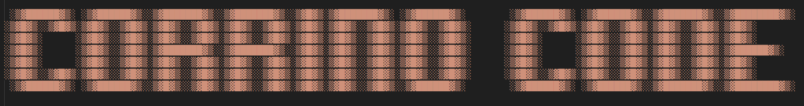

<h2 align="center">
 <br>
 
 <br>
 <br>
 Corrino Code CLI: a fork of Groq Code CLI but with more open source and more Dune.
 <br>
</h2>

<p align="center">
 <a href="https://github.com/build-with-groq/groq-code-cli/stargazers"></a>
 <a href="https://github.com/build-with-groq/groq-code-cli/blob/main/LICENSE">
 
 </a>
</p>

<p align="center">
 <a href="#Overview">Overview</a> •
 <a href="#Installation">Installation</a> •
 <a href="#Usage">Usage</a> •
 <a href="#Development">Development</a>
</p>

<br>


# Overview

Thanks to the awesome open source project from the Groq team, and of course the encouragement to do with it as you want, I present you Corrino Code. It adds on to the original code by:

- allowing you to add custom providers (like Ollama, LMStudio, OpenRouter)
- adding an /init command which will generate a CORRIN.md file
- extends the logging capabilities and adds logs at project level for a more accessible view on the agents actions
- provides epic quotes from Dune by Frank Herbert as it works (this alone should be reason enough to use this)


## Installation

### For Development (Recommended)
```bash
git clone https://github.com/jtcorrin/corrin-code-cli.git
cd corrin-code-cli
npm install
npm run build
npm link        # Enables the `corrino` command in any directory
```

```bash
# Run this in the background during development to automatically apply any changes to the source code
npm run dev  
```

## Usage
```bash
# Start chat session
corrino

# Start a chat session with juicy logs
corrino -d
```

### Command Line Options

```bash
groq [options]

Options:
  -t, --temperature <temp>      Temperature for generation (default: 1)
  -s, --system <message>        Custom system message
  -d, --debug                   Enable debug logging to debug-agent.log in current directory
  -h, --help                    Display help
  -V, --version                 Display version number
```

### Authentication (from the original groq)

On first use, start a chat:

```bash
corrino
```

And type the `/login` command:


>Get your API key from the <strong>Groq Console</strong> [here](https://console.groq.com/keys)

This creates a .groq/ folder in your home directory that stores your API key, default model selection, and any other config you wish to add.

You can also set your API key for your current directory via environment variable:
```bash
export GROQ_API_KEY=your_api_key_here
```

### Available Commands
- `/help` - Show help and available commands
- `/login` - Login with your credentials
- `/model` - Select your Groq model
- `/clear` - Clear chat history and context
- `/reasoning` - Toggle display of reasoning content in messages
- `/init` - allow the agent to gain an understanding of the project, which is saved in a CORRIN.md file and drawn upon in future sessions


### Customization

#### Adding New Tools

Tools are AI-callable functions that extend the CLI's capabilities. To add a new tool:

1. **Define the tool schema** in `src/tools/tool-schemas.ts`:
```typescript
export const YOUR_TOOL_SCHEMA: ToolSchema = {
  type: 'function',
  function: {
    name: 'your_tool_name',
    description: 'What your tool does',
    parameters: {
      type: 'object',
      properties: {
        param1: { type: 'string', description: 'Parameter description' }
      },
      required: ['param1']
    }
  }
};
```

2. **Implement the tool function** in `src/tools/tools.ts`:
```typescript
export async function yourToolName(param1: string): Promise<ToolResult> {
  // Your implementation here
  return createToolResponse(true, result, 'Success message');
}
```

3. **Register the tool** in the `TOOL_REGISTRY` object and `executeTool` switch statement in `src/tools/tools.ts`.

4. **Add the schema** to `ALL_TOOL_SCHEMAS` array in `src/tools/tool-schemas.ts`.

#### Adding New Slash Commands

Slash commands provide direct user interactions. To add a new command:

1. **Create command definition** in `src/commands/definitions/your-command.ts`:
```typescript
import { CommandDefinition, CommandContext } from '../base.js';

export const yourCommand: CommandDefinition = {
  command: 'yourcommand',
  description: 'What your command does',
  handler: ({ addMessage }: CommandContext) => {
    // Your command logic here
    addMessage({
      role: 'system',
      content: 'Command response'
    });
  }
};
```

2. **Register the command** in `src/commands/index.ts` by importing it and adding to the `availableCommands` array.

#### Changing Start Command
To change the start command from `groq`, change `"groq"` in `"bin"` of `package.json` to your global command of choice.

Re-run `npm run build` and `npm link`.


## Contributing and Support

Improvements through PRs are welcome!

For issues and feature requests, please open an issue on GitHub.

#### Share what you create with Groq on our [socials](https://x.com/GroqInc)!

### Featured Community Creations
- [OpenRouter Support](https://github.com/rahulvrane/groq-code-cli-openrouter) - rahulvrane
